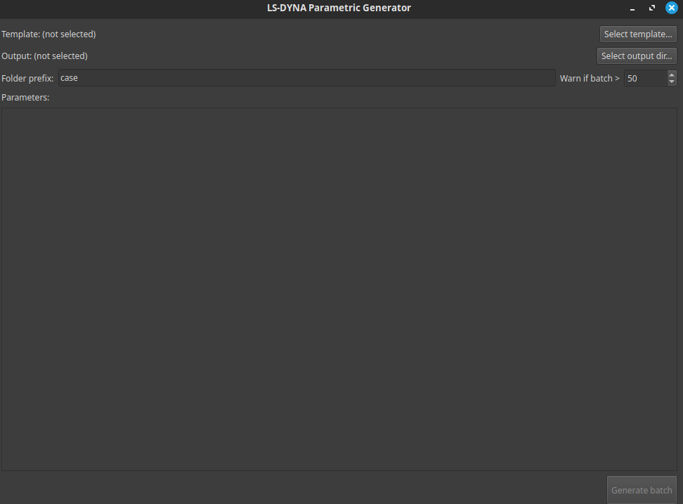
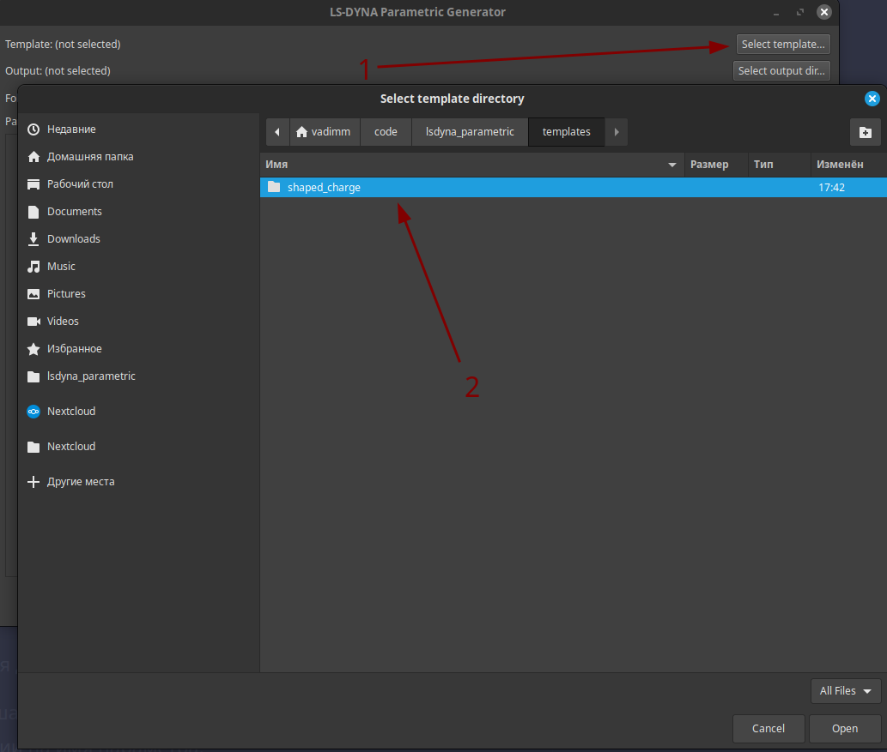
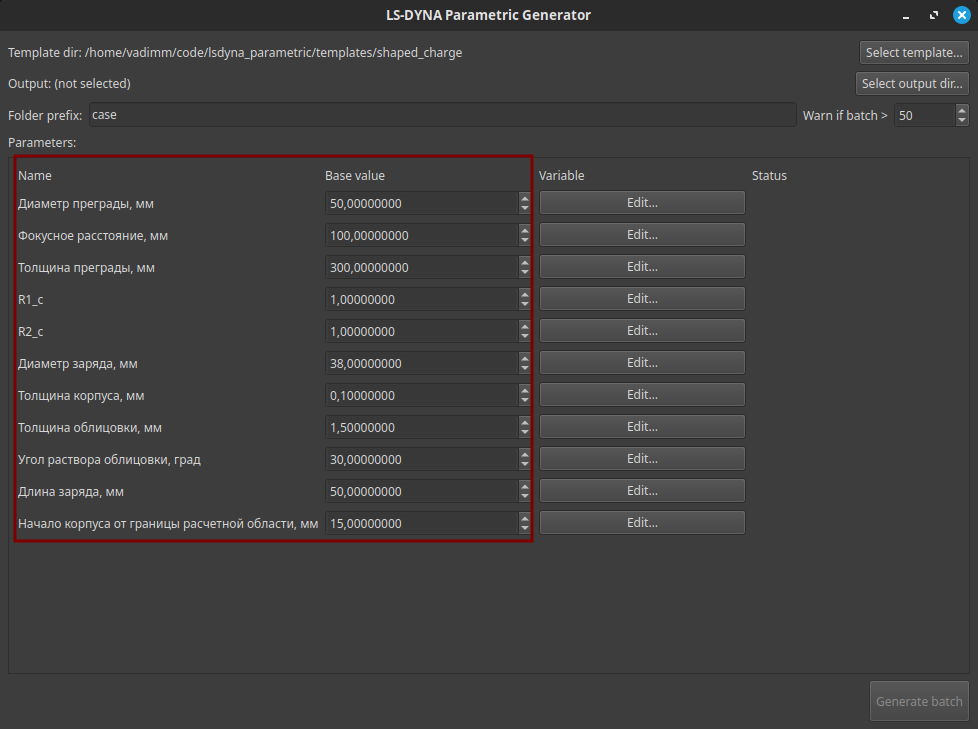
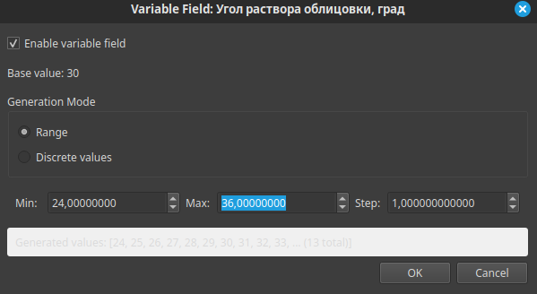
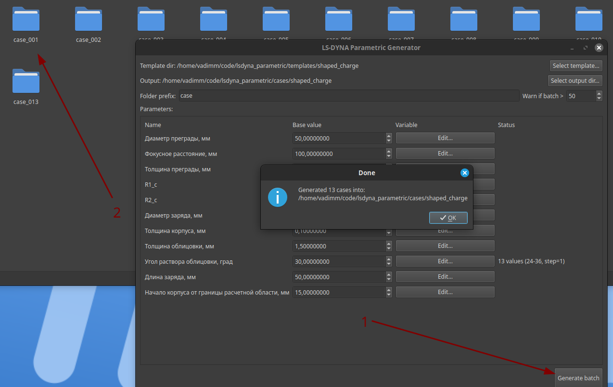

# lsdyna_parametric

Минимальный GUI-инструмент для параметрической генерации LS-DYNA кейсов из Jinja2-шаблона.

## Запуск (из корня текущего репозитория)

```
uv sync или pip install -r requirements.txt
uv run python -m main или python -m main
```

## Работа с программой

Полная последовательность работы приведена на скриншотах из данной [папки](images/):

- Главное окно программы



- Выбор папки с шаблоном



- Просмотр доступных параметров



- Назначение варьируемых парамтеров



- Выбор папки для сохранения и префикс папки с получившимися `.k`-файлами


- Генерация расчетных файлов



## Ожидаемая структура шаблона

- Пользователь выбирает папку шаблона.
- В папке шаблона должен быть файл `input.template` (Jinja2).
- Параметры извлекаются только из простых выражений вида `{{ param_name }}` (без точек).
- В папке шаблона может лежать `config.toml` с секцией `[template_params]` для значений по умолчанию.
- В папке шаблона может лежать `params_info.json` для человеко-читаемых имен и описаний параметров (используется только в GUI).

Рекомендуемая структура файла шаблона должна выглядеть следующим образом

```
$# LS-DYNA Keyword file created by LS-PrePost(R) V4.10.11-27Mar2024
$# Created on Aug-18-2025 (11:06:56)
*KEYWORD
*TITLE
$#                                                                         title
LS-DYNA keyword deck by LS-PrePost
*PARAMETER
$#   prmr1      val1     prmr2      val2     prmr3      val3     prmr4      val4
R d       {{ d }}                                                                  
R del_k   {{ del_k }}                                                                  
...
```
где `d` и `del_k` обозначают варьируемые параметры, которые используются в дальнейшем штатными средствами LS-DYNA (через `&param_name` для использования парамета или `<param_name + 1>` для выражений)

Гипотетически можно использовать и формат:

```
*NODE
$HE start here
$#   nid               x               y               z      tc      rc
       1             0.0  {{param_name}}             0.0       0       0
```

Но программа пока не предусматривает корректное форматирование в таких случаях (с учетом количества знаков после запятой и допустимого количества символов на одно значение) и можно получить ошибку форматирования при запуске

### `params_info.json`


Файл лежит рядом с `input.template` и используется для отображения параметров в GUI:

- `name` — отображаемое имя (вместо имени из шаблона).
- `description` — подсказка (tooltip) при наведении на имя параметра.

Если `params_info.json` отсутствует/битый/неполный, программа молча использует имена параметров из шаблона.

Формат (рекомендуемый):

```json
{
  "params": {
    "d": { "name": "Диаметр", "description": "..." },
    "gamma": { "name": "Угол", "description": "..." }
  }
}
```

## Выход

В выбранной папке создаются подпапки `prefix_001`, `prefix_002`, ... и т.д., куда копируются все файлы из папки шаблона. Затем:

- рендерится `input.k` из выбранного шаблона;
- `config.toml` в кейсе перезаписывается значениями `[template_params]` и настройками варьируемости.
